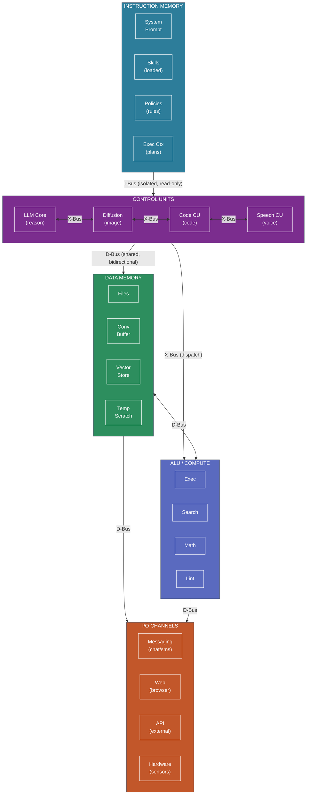

# 2. Architectural Overview

[< Motivation](01-motivation.md) | [Component Specifications >](03-components.md)

## 2.1 Core Components

The Stochastic Harvard Architecture defines five classes of components:

| Component | Role | Analog |
|---|---|---|
| **Control Unit (CU)** | Stochastic inference engine (LLM, diffusion model, etc.) that reads instructions and data, then dispatches operations | CPU control unit |
| **Arithmetic Logic Unit (ALU)** | Deterministic compute resource (conventional CPU, container, sandbox) that executes precise operations dispatched by a CU | CPU ALU / coprocessor |
| **Instruction Memory (IMEM)** | Protected storage for system prompts, skills, policies, persona definitions, and execution context | Instruction ROM / cache |
| **Data Memory (DMEM)** | General-purpose storage for files, conversation history, tool outputs, embeddings, and working data | Data RAM / storage |
| **I/O Channels** | Interfaces to external systems — messaging platforms, web, APIs, hardware, sensors, displays | I/O ports / peripherals |

## 2.2 Bus Architecture

The system defines three bus types with distinct access semantics:

**Instruction Bus (I-Bus)**
- Connects: IMEM → CU (read path)
- Direction: Primarily IMEM → CU. Write path exists only through a controlled **firmware update gate** (see [§4.3](04-bus-protocols.md#43-verification-gates)).
- Isolation: **No component on the data bus may write to instruction memory.** This is the core security invariant.
- Content: System prompts, skill definitions, policy rules, execution plans.

**Data Bus (D-Bus)**
- Connects: DMEM ↔ CU, DMEM ↔ ALU, I/O ↔ DMEM, I/O ↔ CU
- Direction: Bidirectional, multi-access.
- Isolation: None — shared resource. All untrusted content flows on this bus.
- Content: User messages, file contents, tool outputs, web page text, conversation history.

**Dispatch Bus (X-Bus)**
- Connects: CU → CU, CU → ALU
- Direction: Command dispatch from control units to execution resources.
- Content: Structured operation requests (tool calls, inter-model routing, compute tasks).

## 2.3 System Diagram

