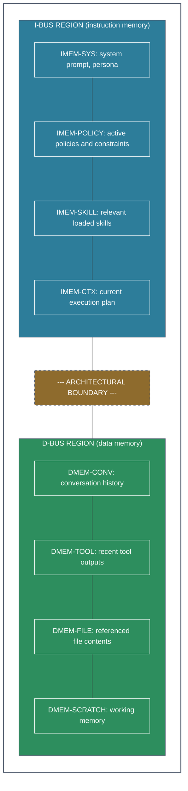

# 4. Bus Protocols and Enforcement

[< Component Specifications](03-components.md) | [Scheduling and Execution Model >](05-execution-model.md)

## 4.1 Bus Controller

The system includes a **bus controller** that mediates all inter-component communication. The bus controller is a deterministic component (conventional software, not a stochastic model) that enforces:

- **Bus isolation:** Data bus content cannot be routed to instruction memory.
- **Access control:** Components can only access buses they are authorized for.
- **Policy enforcement:** Operations that violate IMEM-POLICY are blocked at the bus level.
- **Audit logging:** All bus transactions are logged for observability.
- **Rate limiting:** CU inference cycles and ALU executions are rate-limited per policy.

The bus controller is the **trusted computing base** of the architecture. Its correctness is what makes the security guarantees hold. It must be small, auditable, and deterministic.

## 4.2 Context Window Composition

When a CU performs an inference cycle, its context window is composed from two separate buses:

The bus controller composes this context window before each inference call. The I-Bus and D-Bus regions are assembled **separately** and concatenated with an architectural boundary. The CU (model) sees both regions but the boundary is enforced **below the model** — even if the model is confused about which region is which, the bus controller's composition logic is deterministic and cannot be manipulated by content in either region.

**Implementation note:** In current LLM APIs, this maps to the system/user/assistant message role structure — but with the critical addition that the system region is composed entirely from verified IMEM content, and the user/tool regions are composed entirely from DMEM content. The bus controller, not the application code, owns this composition.

## 4.3 Verification Gates

A **verification gate** is a controlled pathway that allows content to cross from the data bus to instruction memory under strict conditions. This is necessary for operations like:

- Installing a new skill (user provides skill definition → verified → written to IMEM-SKILL)
- Updating the execution plan (CU decides on a new plan → verified → written to IMEM-CTX)
- Modifying policies (administrator issues policy change → verified → written to IMEM-POLICY)

Each gate enforces:

1. **Provenance verification:** Where did this content originate? Is the source trusted?
2. **Content validation:** Does the content conform to the expected schema for this IMEM segment?
3. **Authorization:** Does the requesting entity have permission to modify this IMEM segment?
4. **Audit:** The modification is logged with full context.

**Critical:** The verification gate is a **deterministic, conventional software component** — not a stochastic model. The decision to allow instruction memory modification is not made by an LLM. It is made by auditable code with explicit rules.
