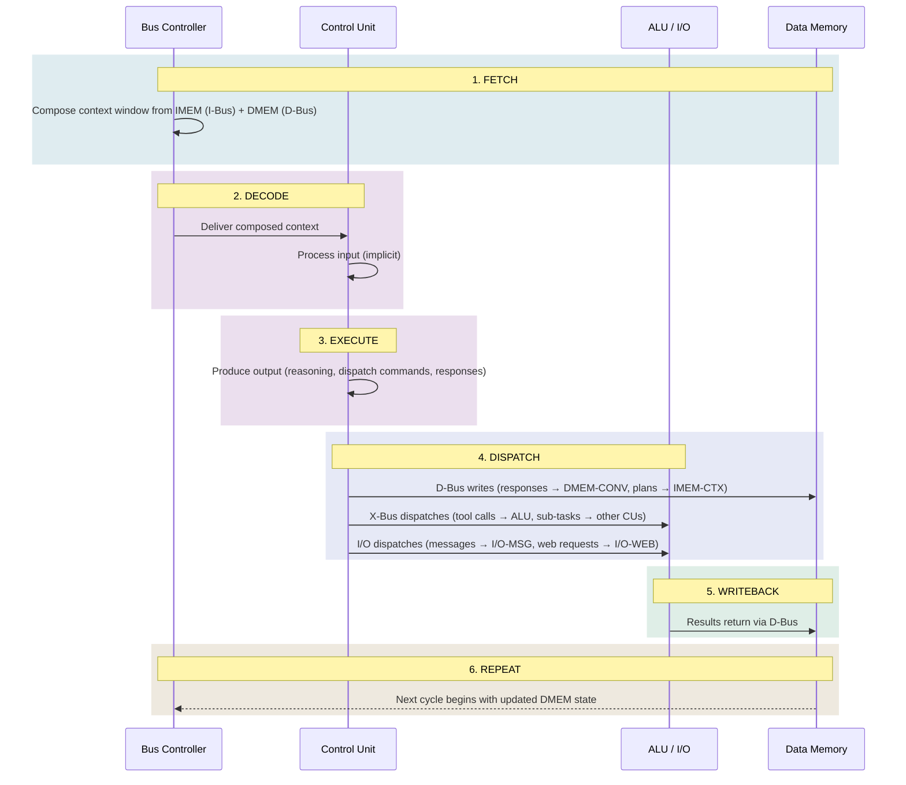

# 5. Scheduling and Execution Model

[< Bus Protocols and Enforcement](04-bus-protocols.md) | [Modified Harvard Considerations >](06-modified-harvard.md)

## 5.1 The Stochastic Cycle

A traditional CPU executes billions of instructions per second, each taking nanoseconds. A stochastic CU executes one "inference cycle" in seconds, but each cycle accomplishes what might require thousands of conventional instructions. This inverts the traditional scheduling model.

### 5.1.1 Cycle Anatomy

### 5.1.2 Cycle Scheduling

Because CU cycles are expensive (seconds, dollars), scheduling matters more than in conventional systems:

**Eager dispatch:** When a CU identifies multiple independent operations, dispatch them simultaneously to ALU cores and other CUs. Don't serialize unnecessarily.

**Batched context:** Accumulate multiple inbound events (messages, tool results) before triggering a CU cycle, rather than cycling per-event.

**Tiered CU routing:** Route simple tasks to cheaper/faster CUs (smaller models) and complex tasks to more capable CUs. The bus controller or a lightweight router can make this determination without burning a full CU cycle.

**Speculative execution:** For high-latency operations, dispatch the likely next operation before the current one completes. If wrong, discard. The cost of a wasted ALU cycle is trivial compared to a wasted CU cycle.

## 5.2 Determinism and Verification

Because the CU is stochastic, the architecture must handle **nondeterministic execution** as a first-class concern.

**Verification strategies:**

- **Post-hoc validation:** After a CU produces a dispatch, the bus controller validates it against IMEM-POLICY before execution. Invalid dispatches are rejected deterministically.
- **Consensus:** For high-stakes operations, route the same input to multiple CUs (same or different models) and require agreement.
- **Rollback:** ALU operations are executed in sandboxed environments. If a CU cycle produces an unexpected result, the ALU state can be rolled back.
- **Confidence gating:** CU output includes confidence signals. Low-confidence dispatches are routed to human review via I/O rather than executed.
