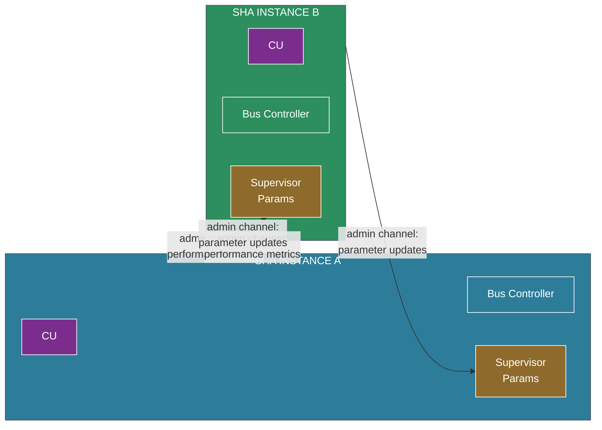

# ADR-101: Multi-Instance Peer Supervision Topology

## Context

ADR-302 defines two optimization loops for the adaptive supervisor: an inner homeostatic loop (self-regulating) and an outer administrative loop (tuning parameters against performance goals). The outer loop was specified as flowing through the same authenticated administrative channel as IMEM-SYS and IMEM-POLICY updates.

A key observation: if the outer loop is performed by a *second SHA instance* rather than a human administrator, the architecture naturally enforces peer review properties:

1. **Isolation**: The second instance has its own D-Bus with different data. It cannot be influenced by the same adversarial content that might compromise the first instance's CU.
2. **No self-grading**: A system's own CU has no path to its own supervisor parameters (bus isolation prevents it). Only an external system, through the administrative channel, can tune them.
3. **Reciprocity**: The first instance can perform the same administrative tuning for the second. Neither system is privileged — both are simultaneously operator and subject of review.

This begins to resemble peer review at the architectural level — not as a social process bolted on, but as a structural property of connected SHA instances.

## Decision

### Peer Supervision as Architectural Pattern

Two or more SHA instances can be connected in a **peer supervision topology** where each instance performs administrative tuning of its peers' supervisor parameters.

**What flows between peers:**

| Direction | Content | Channel |
|-----------|---------|---------|
| Instance → Peer | Aggregate performance metrics (false positive rate, detection rate, escalation rate, latency) | Admin channel (authenticated, audited) |
| Peer → Instance | Parameter adjustment recommendations (threshold changes, decay rate updates, score mapping) | Admin channel, through verification gate |

**What does NOT flow:**

- No D-Bus content crosses between instances. Instance A never sees Instance B's user conversations, tool outputs, or file contents.
- No IMEM content crosses. Instance A never sees Instance B's system prompt, skills, or policies.
- No dispatch-level data. The peer sees *aggregate statistics*, not individual dispatches.

This preserves privacy between instances while enabling mutual calibration.

### Shared General Guidelines

All instances in a peer topology share a common set of **baseline operating guidelines** — general principles about supervisor behavior, acceptable parameter ranges, and calibration targets. These guidelines are:

- Distributed as IMEM-POLICY content, installed through each instance's standard skill/policy verification gate
- Versioned and signed — all peers in a topology run the same guideline version (or explicitly declared compatible versions)
- The guidelines define the *bounds* within which peer tuning operates, not the specific parameter values. A peer can adjust another instance's escalation threshold within the guideline range, but cannot set it outside that range.

This creates a three-tier governance model:

| Tier | Scope | Authority | Update Frequency |
|------|-------|-----------|-----------------|
| **Guidelines** | All instances in topology | Human / organizational decision | Rare (policy-level) |
| **Peer tuning** | Per-instance supervisor params | Peer SHA instance | Periodic (outer loop) |
| **Self-calibration** | Per-instance pattern store | Instance's own homeostatic loop | Continuous (inner loop) |

Guidelines constrain peer tuning. Peer tuning constrains self-calibration. Each layer is isolated from the one below.

### Scaling Beyond Pairs

The peer topology is not limited to two instances:

**Mesh (all-to-all)**: Every instance reviews every other instance. Provides maximum coverage but O(N²) review relationships. Suitable for small clusters.

**Ring**: Each instance reviews one neighbor. Minimal overhead but single point of failure — if one instance is compromised, its downstream neighbor loses its reviewer. Suitable for chains of trust where instances have ordered trust relationships.

**Hierarchical**: Designated reviewer instances that don't perform primary work, only administrative tuning. Analogous to a dedicated supervisor node. Higher cost but clearer trust model. The reviewer instances have their own bus isolation — they read only aggregate metrics, not operational data.

**Consensus**: Parameter changes require M-of-N peer agreement before application. Provides Byzantine fault tolerance — a single compromised peer cannot corrupt another instance's supervisor parameters. Most robust but highest latency for parameter updates.

### What This Is Not

This is not a multi-agent framework in the sense of multiple CUs collaborating on a task. The CUs in different instances are completely independent — they may serve different users, run different models, perform different tasks. The peer relationship exists only at the **infrastructure supervision layer**, not at the operational layer.

The instances share:
- Baseline guidelines (what good supervisory behavior looks like)
- Aggregate performance metrics (how each instance is doing)
- Parameter adjustment authority (the ability to tune each other's supervisors)

They do not share:
- Data (user content, files, conversations)
- Instructions (system prompts, skills, policies beyond shared guidelines)
- Operational state (execution plans, dispatch history)

### Emergent Properties

**Convergent calibration**: If all instances in a topology share guidelines and review each other, their supervisor parameters tend to converge toward a shared operating point — not identical (different workloads produce different optimal parameters) but within the same neighborhood. This is analogous to how peer review in science produces rough consensus without requiring uniformity.

**Compromise resilience**: If one instance's CU is influenced by adversarial data and begins producing anomalous dispatches, its peer reviewer observes the performance metrics shifting (higher escalation rate, unusual patterns) and can tighten supervisor parameters or flag for human attention — without being exposed to the same adversarial data. The compromised instance can't prevent this because it has no path to its reviewer's decision-making.

**Structural accountability**: Every parameter change is traceable to a specific peer instance, through an authenticated channel, with an audit log. No instance can claim "I was told to relax my security" without that claim being verifiable against the audit trail.

## Consequences

### Positive

- Peer review emerges from architectural properties rather than being bolted on as a process
- No instance can self-modify its supervisor parameters — structural enforcement of external review
- Privacy-preserving: only aggregate metrics cross instance boundaries, never operational data
- Compromise of one instance is observable by peers without exposing peers to the same attack vector
- Shared guidelines ensure all instances operate within organizationally-defined bounds

### Negative

- Adds network connectivity requirements between instances
- Peer instances must be mutually authenticated — key management complexity
- Latency for parameter updates depends on topology (mesh is fast, consensus is slow)
- A coordinated attack on all peers simultaneously could defeat the topology — shared guidelines become a single point of failure

### Neutral

- This pattern is orthogonal to the operational architecture — instances can run completely different workloads while still peer-reviewing each other's supervisor health
- Opens the question of cross-organizational peer topologies — can instances run by different organizations review each other? Trust federation becomes a governance question, not a technical one.

## Alternatives Considered

- **Human-only administration**: Viable for single instances but doesn't scale. Humans can still override peer decisions through the same admin channel — peers augment human oversight, they don't replace it.
- **Central supervisor service**: A single service that tunes all instances. Simpler but creates a single point of failure and trust concentration. The peer model distributes trust.
- **No cross-instance supervision**: Each instance operates independently. Works but forgoes the compromise resilience and convergent calibration benefits. Fine for isolated deployments, suboptimal for fleets.
