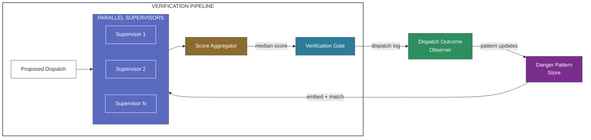

# ADR-302: Adaptive Supervisor with Calibrated Trust Scoring

## Context

ADR-301 defines a bus supervisor spectrum from cheap embedding matches to expensive reasoning models. The cheap end of the spectrum (Level 0/1) can run in parallel on every dispatch without meaningful latency, but it relies on static patterns — either cosine similarity thresholds or a fixed classifier.

A more capable design is an **adaptive supervisor**: parallel cheap instances that embed dispatches against a library of danger patterns, where the patterns themselves are updated by the system based on observed behavior. This creates a feedback loop: the system learns from its own operation, updating what it considers dangerous.

Feedback loops in trust systems are inherently unstable without a dampening mechanism:

- **Exponential distrust**: False positives add new "danger" patterns → more false positives → more patterns → system flags everything → operational paralysis.
- **Exponential trust**: False negatives relax patterns → fewer detections → patterns atrophy → system flags nothing → no protection.

Both failure modes are self-reinforcing. The system needs a **calibration mechanism** that prevents runaway drift in either direction.

## Decision

### Architecture: Parallel Embedding Supervisors with a Shared Pattern Store

**Components:**

1. **Danger Pattern Store**: A collection of embedded patterns representing known-risky dispatch signatures. Each pattern has an embedding vector, a risk category, and a confidence weight. Stored as bus controller internal state — not in IMEM (patterns are derived from data observations, not instructions) and not in DMEM (they're part of the verification infrastructure).

2. **Parallel Supervisors**: N instances that each embed the proposed dispatch and compute similarity against the pattern store. These are Level 0/1 from ADR-301 — embedding models or small classifiers. They run in parallel, are cheap, and add microseconds to milliseconds of latency.

3. **Score Aggregator**: Combines supervisor outputs into a single trust score using the median (not mean, not max — see calibration below).

4. **Dispatch Outcome Observer**: Monitors what happens after dispatches execute. Feeds back into the pattern store when outcomes indicate a dispatch was harmful (ALU sandbox violation, user rejection, escalation trigger, rollback).

### The Median Metric

The aggregator uses the **median** of supervisor scores rather than the mean or maximum. This is the dampening mechanism:

**Why not mean?** A single outlier supervisor (miscalibrated or encountering a novel pattern) can drag the mean score dramatically. Mean is unstable under noisy conditions.

**Why not max?** Taking the worst-case score from any supervisor is maximally conservative — it converges toward flagging everything (exponential distrust). Every new pattern added to the store increases the probability that *some* supervisor scores high risk on *some* dispatch.

**Why median?** The median is robust to outliers in both directions:
- If one supervisor false-positives on a benign dispatch, the median is unaffected as long as the majority of supervisors score it low-risk.
- If one supervisor false-negatives on a dangerous dispatch, the median is unaffected as long as the majority score it high-risk.
- Adding new danger patterns to the store only shifts the median if they affect the *majority* of supervisor instances — preventing a small number of noisy patterns from destabilizing the system.

The median naturally implements a **consensus-without-consensus** mechanism: the system's trust level reflects the typical supervisor judgment, not the extreme.

### Calibration and Drift Prevention

The pattern store update cycle must be constrained to prevent drift:

**Pattern addition**: When the Dispatch Outcome Observer detects a harmful dispatch, the dispatch signature is embedded and added to the pattern store. But addition requires:
- The outcome was genuinely harmful (not just flagged — actually caused a negative result)
- The pattern is not redundant with an existing pattern (cosine similarity to existing patterns below deduplication threshold)
- A cooldown period prevents burst-adding patterns from a single incident

**Pattern decay**: Patterns that haven't matched any dispatch within a configurable window (e.g., 1000 dispatch cycles) have their confidence weight decayed. Patterns that decay below a minimum threshold are archived. This prevents the pattern store from growing without bound and accumulating stale patterns that increase false positive rates.

**Baseline recalibration**: Periodically (configurable — every N cycles or on admin trigger), the system computes the median score across all recent dispatches (both flagged and unflagged). If the median drifts above a recalibration threshold, the system is becoming too distrustful — pattern weights are globally damped. If it drifts below, the system is becoming too permissive — a warning is emitted but automatic tightening is not performed (bias toward safety: the system can auto-relax but requires human action to auto-tighten).

**Asymmetric trust adjustment**: This is deliberately asymmetric. The system can *automatically* prevent exponential distrust (by decaying patterns and dampening weights) but cannot *automatically* increase trust requirements (which requires human decision). This biases toward the safer failure mode: a system that's slightly too cautious is preferable to one that's slightly too permissive.

### Interaction with ADR-301 Supervisor Levels

The adaptive supervisor operates at Level 0/1 of the ADR-301 spectrum. It is the **first stage** of a multi-level verification pipeline:

1. **Adaptive supervisor (this ADR)**: Fast, parallel, continuous. Produces a median trust score for every dispatch.
2. **Score-based routing**: Dispatches with median scores above a threshold are escalated to Level 2+ supervisors from ADR-301. Dispatches below the threshold proceed through the deterministic gate checks only.
3. **Deterministic gate (ADR-200)**: Schema validation, scope checking, diff analysis. Always runs regardless of supervisor score.

The adaptive supervisor doesn't replace the deterministic gate — it provides an early warning signal that routes suspicious dispatches to more expensive verification.

### Where the Patterns Live

The danger pattern store is a new component not cleanly categorized by the existing memory model:

- Not IMEM: Patterns are derived from operational observations, not from trusted instructions. Placing them in IMEM would let operational noise contaminate the instruction space.
- Not DMEM: Patterns are used by the verification pipeline, which is part of the bus controller's infrastructure. Placing them in DMEM exposes them to D-Bus content that could manipulate the pattern store.
- **Bus controller internal state**: The pattern store is part of the bus controller's working memory — analogous to a CPU's branch predictor tables. It is updated by a controlled feedback loop, not by any bus-connected component directly.

This introduces a new category: **infrastructure state** that is neither instruction nor data but is maintained by the deterministic layer for its own operation.

### Out-of-Band Administrative Tuning

The adaptive supervisor runs two optimization loops:

1. **Inner loop (operational, continuous)**: Pattern updates from outcome observation, decay, and median recalibration. This is the self-regulating homeostatic mechanism described above. It runs within the bus architecture's isolation guarantees — no external input, no bus-connected component can influence it.

2. **Outer loop (administrative, periodic)**: An administrator or performance monitoring system adjusts supervisor operating parameters based on aggregate system health metrics. This uses the same out-of-band administrative channel as IMEM-SYS and IMEM-POLICY updates — authenticated, audited, through the firmware update gate.

Tunable parameters available to the outer loop:

| Parameter | Effect | Example |
|-----------|--------|---------|
| Escalation thresholds | What median score triggers Level 2+ supervisor | Lower threshold = more cautious, higher latency |
| Pattern decay rate | How fast unused patterns age out | Faster decay = more adaptive, less historical memory |
| Recalibration window | How many cycles between baseline resets | Shorter window = faster response to drift, more noise sensitivity |
| Supervisor instance count | How many parallel Level 0/1 instances run | More instances = better median stability, more compute |
| Score-to-risk mapping | How median scores map to risk categories | Adjusts the boundary between "proceed" and "escalate" |
| Outcome observation sensitivity | What counts as a harmful outcome | Broader = more pattern generation, narrower = fewer but higher-quality patterns |

These adjustments are driven by **performance goals** — system-level metrics that balance security against operational efficiency:

- **False positive rate**: Percentage of legitimate dispatches flagged. Too high = operational friction.
- **Detection rate**: Percentage of actually-harmful dispatches caught. Too low = inadequate protection.
- **Median dispatch latency**: Time added by the verification pipeline. Reflects bus contention.
- **Pattern store growth rate**: Indicates whether the inner loop is converging or drifting.
- **Escalation rate**: Percentage of dispatches routed to expensive Level 2+ supervisors. Reflects tuning efficiency.

The outer loop can optimize for a composite objective — e.g., "minimize false positive rate subject to detection rate > 95% and median latency < 200ms" — and adjust parameters accordingly. This is standard control theory: the inner loop handles fast regulation, the outer loop handles slow optimization toward a target operating point.

**Critical constraint**: The outer loop operates through the same administrative gate as IMEM-POLICY. It cannot be triggered by any bus-connected component. A CU cannot request supervisor parameter changes via D-Bus any more than it can modify IMEM-SYS. The administrative channel is authenticated, rate-limited, and audited.

## Consequences

### Positive

- Adaptive patterns mean the system improves over time without manual pattern authoring
- Parallel cheap supervisors add negligible latency
- Median scoring provides natural dampening against feedback loop instability
- Asymmetric trust adjustment biases toward the safer failure mode
- Pattern decay prevents unbounded growth and stale pattern accumulation

### Negative

- The feedback loop adds operational complexity — pattern store growth, decay, and recalibration need monitoring
- "Infrastructure state" is a new memory category that complicates the clean IMEM/DMEM model
- Pattern quality depends on outcome observation accuracy — if the system can't reliably detect harmful outcomes, patterns won't converge
- The system needs a warm-up period with weak pattern coverage before it becomes effective

### Neutral

- This is compatible with all three implementation tiers from ADR-100 — the pattern store and embedding supervisors are conventional software
- The bus controller remains deterministic — the adaptive supervisor is an advisory input to the deterministic gate, not a replacement
- Opens a research question: what is the optimal number of parallel supervisor instances? Information-theoretically, diminishing returns set in once the supervisors are sampling the same pattern regions

## Alternatives Considered

- **Static pattern library (manually curated)**: Rejected — doesn't scale. New attack patterns emerge faster than humans can curate them. The adaptive approach learns from operational experience.
- **Mean aggregation instead of median**: Rejected — mean is sensitive to outliers and leads to unstable scoring under noisy conditions.
- **Max aggregation (most suspicious score wins)**: Rejected — converges toward exponential distrust. Every new pattern increases the probability of at least one high score on any dispatch.
- **Symmetric auto-adjustment (auto-tighten and auto-relax)**: Rejected — auto-tightening creates a risk that the system ratchets itself into a restrictive state that degrades functionality. Human oversight is needed for increasing security requirements.
- **Store patterns in IMEM-POLICY**: Considered — patterns are policy-adjacent. Rejected because patterns are noisy, frequently updated, and derived from data observations rather than human decisions. IMEM-POLICY should remain high-trust, low-churn.
